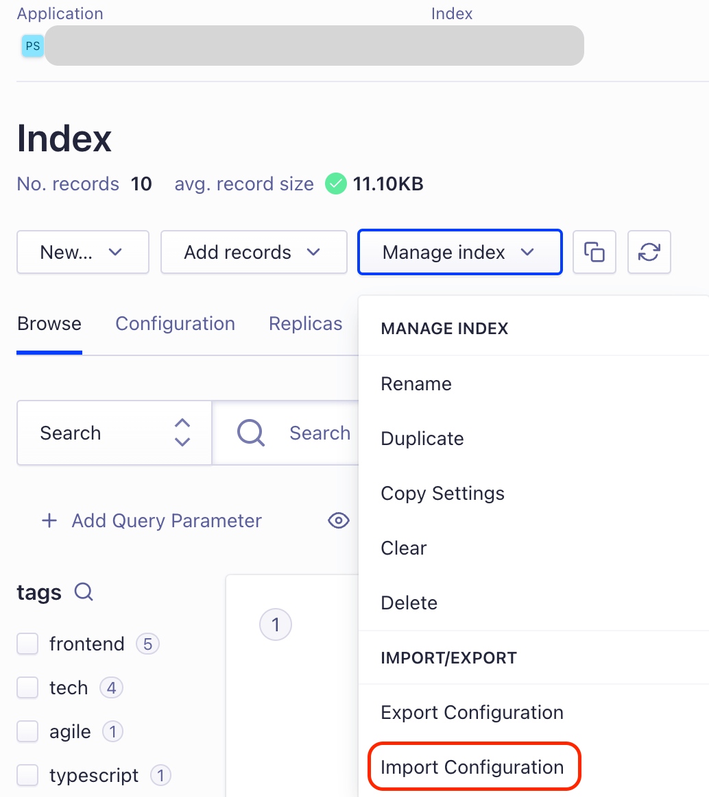

The site has been re-implemented in TinaCMS; the previous version used highly customized Strapi. Strapi itself is a really good service. It just doesn't guarantee stability with any free-tier backend services.

# Renewal Goal

- must not show error page
  - this was due to slow-bootup time of free-tier backend services
- maintain full-pledged markdown support
- maintain same(at least similar look to the previous one)
- must be able to edit even when away from main computer, without dev environment settings

# Reference

- https://stackoverflow.com/questions/69870137/running-a-single-ts-file-in-a-next-js-project-with-ts-node-for-testing
- https://github.com/vercel/turbo/discussions/1027

# Troubleshooting

## Testing Turbobuild on Local Machine

```sh
# testing build
pnpm turbo build --filter=@sungryeol/app-portfolio-2022
# testing deploy
pnpm turbo deploy --filter=@sungryeol/app-portfolio-2022
```

## Algolia Search Indexing

```sh
pnpm search-index
```

If algolia index does not match, try to import the `algolia-config.json`.\
Do not forget to export the config after changing settings.\

